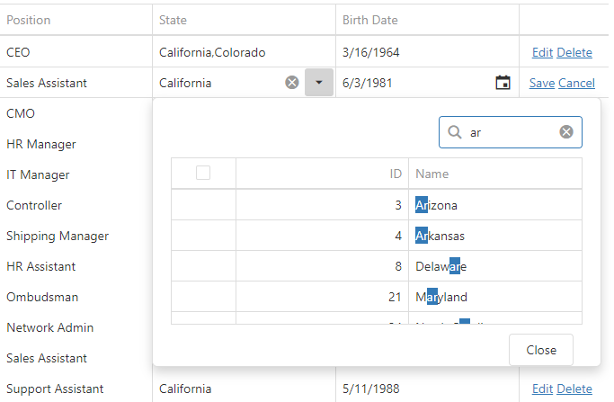

<!-- default badges list -->

[](https://supportcenter.devexpress.com/ticket/details/T576412)
[](https://docs.devexpress.com/GeneralInformation/403183)
<!-- default badges end -->
# MVC DataGrid - How to use DropDownBox as a column editor in edit mode

This example illustrates how to embed DevExtreme ASP.NET MVC [DropDownBox](https://docs.devexpress.com/AspNetCore/DevExtreme.AspNet.Mvc.Builders.DropDownBoxBuilder) into an edit cell in the DevExtreme ASP.NET MVC [DataGrid](https://docs.devexpress.com/AspNetCore/DevExtreme.AspNet.Mvc.Builders.DataGridBuilder-1). 

<!-- run online -->
**[[Run Online]](https://codecentral.devexpress.com/t576412/)**
<!-- run online end -->



Refer to the [DevExtreme DataGrid - How to use DropDownBox as a column editor in edit mode](https://github.com/DevExpress-Examples/datagrid-how-to-use-dropdownbox-as-a-column-editor-in-edit-mode-t548916) example to see how to implement this task on the client. 

## Files to Look At

* [OrdersController.cs](./MVC/T548916/Controllers/OrdersController.cs)
* [DxDropDownBox.cshtml](./MVC/T548916/Views/Home/DxDropDownBox.cshtml)
* [Index.cshtml](./MVC/T548916/Views/Home/Index.cshtml)

## Implementation Details

Use the 'State' column's [EditCellTemplate](https://docs.devexpress.com/AspNetCore/DevExtreme.AspNet.Mvc.Builders.DataGridColumnBuilder-1.EditCellTemplate.overloads) method to embed DropDownBox into the grid's edit cell.

```cshtml
@(Html.DevExtreme().DataGrid()
    //...
    columns.Add()
        .DataField("StateID")
        .Caption("State")
        .EditCellTemplate(@<text>
            @Html.Partial("DxDropDownBox")
        </text>);
)
```

Use the [DropDownBox.ContentTemplate](https://docs.devexpress.com/AspNetCore/DevExtreme.AspNet.Mvc.Builders.DropDownBoxBuilder.ContentTemplate.overloads) method to display DropDownBox content in table format (in the [DataGrid](https://docs.devexpress.com/AspNetCore/DevExtreme.AspNet.Mvc.Builders.DataGridBuilder-1)). Handle the [DataGrid.OnSelectionChanged](https://docs.devexpress.com/AspNetCore/DevExtreme.AspNet.Mvc.Builders.DataGridBuilder-1.OnSelectionChanged.overloads) event to pass the selected keys to DropDownBox. To adjust the DataGrid selection, handle the [DropDownBox.OnValueChanged](https://docs.devexpress.com/AspNetCore/DevExtreme.AspNet.Mvc.Builders.DropDownBoxBuilder.OnValueChanged.overloads) event.

```cshtml
@(Html.DevExtreme().DropDownBox()
    //...
    .OnValueChanged(@"function(args) { gridBox_valueChanged(args, setValue); }")
    .ContentTemplate(@<text>
        @(Html.DevExtreme().DataGrid()
            //...
            .Columns(columns =>
            {
                columns.Add().DataField("ID");
                columns.Add().DataField("Name");
            })
            .OnSelectionChanged(@"function(args) { onSelectionChanged(args, component); }")
        )
        //...
    </text>)
)
```

```js
function gridBox_valueChanged(args, setValueMethod) {
    var $dataGrid = $("#dDBoxDataGrid");
    if ($dataGrid.length) {
        var dataGrid = $dataGrid.dxDataGrid("instance");
        dataGrid.selectRows(args.value, false);
    }
    setValueMethod(args.value);
}
function onSelectionChanged(e, dropDownBoxInstance) {
    var keys = e.selectedRowKeys;
    dropDownBoxInstance.option("value", keys);
}
```

## Documentation

[How to Implement templates in DevExtreme ASP.NET MVC](https://docs.devexpress.com/DevExtremeAspNetMvc/400702/get-started/configure-a-project#create-a-new-project-from-templates)
